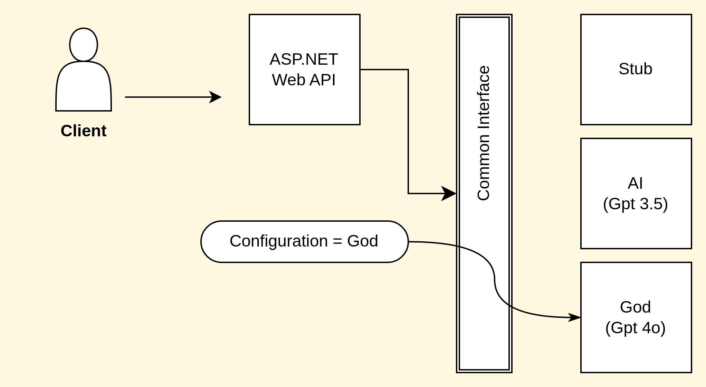

# ハッカソン TeamA 発表

### Member

 koko_u
 aym-sekiguchi
 LalaportK

---

# 作成したアプリケーション

## PersuadeMate

プレゼンテーションを補助する便利ツール

---

# アプリケーションの特徴

- 日常生活で「誘い文句の案出」が苦手な人に役に立つツール
- 誘う相手に応じていい感じの誘い文句を生成してくれます
- 生成された誘い文句を、AI が相手に成り代わって評価してくれます

---

# デモ

○○ さんによる素晴しいデモをご堪能ください。

[PersuadeMate](https://persuademate-frontend-ovkyr72pqq-an.a.run.app/)

---

# 所感

ハッカソンに参加してみて〜

---

##  せきぐち (1/3)

### 担当したこと

- フロントエンドの実装

---

##  せきぐち (2/3)

### 技術的なポイント

- Next.js を使用して SPA を実現
- 細々した工夫(form のバリデーション、ローディング、GOD のアニメーション)

---

##  せきぐち (3/3)

### フロントエンドを担当して

- 思いつきで実装した GOD だが採用されてしまった
- やりたいことが次々出てきて重かった
- でも楽しい(GOD 動かしたり)

---

## ななみん

Excepteur cupidatat cillum ex minim commodo pariatur velit exercitation sit nisi reprehenderit. Sunt amet eu ex exercitation laboris qui commodo sint voluptate excepteur amet. Nisi ullamco commodo amet mollit fugiat.

---

##  こざき (1/3)

### 担当したこと

- バックエンドの実装
- チームリーダーとしての何か

---

##  こざき (2/3)

### 技術的なポイント

- ASP.NET Core Web API で実装。テンプレートで楽ちん
- Dependency Injection でダミーや GPT のモデルを切り替え

---

##  こざき (3/3)

### チーム運営所感

- 開発のモチベーションの維持が難しい。
  仕事なら納期もあるし、後工程の開発もあるしで否が応にも開発するしかないが。
- 縦割り(Frontend, Backend, Infra)の役割分担はよくない。
  機能ごとに分担できた方がより「楽しみ」があった

---

# 総括

---

## 良かった点

-  これまで OpenAI を遠巻きに眺めているだけだったが、実際に触ってみることができた。
- ...
- ...
- ...
- ...

---

## 後悔の残る点

-  もっと github の機能(例えば、Projects)などを活用しても良かったかもしれない。
- ...
- ...
- ...

---

# 以上

ハッカソンの企画・運営ありがとうございました。🙇
